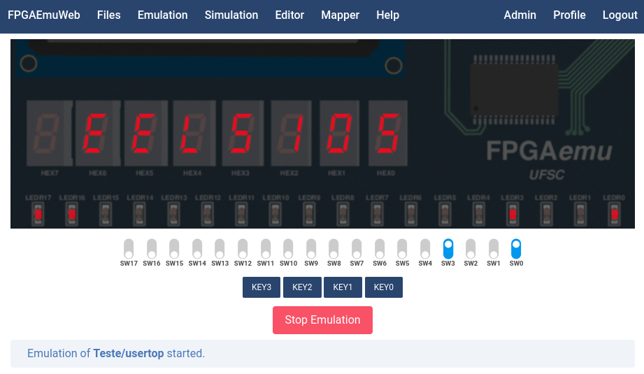
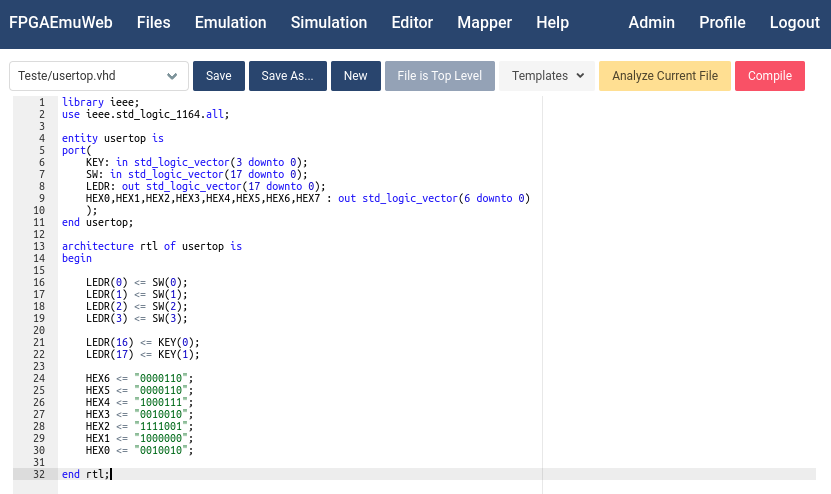

# FPGAEmuWeb 

# About

The **FPGA Emulator Web** (**FPGAEmuWeb**) is a web-based GHDL-based VHDL/FPGA Emulator/Simulator. It has been developed by [Prof. Eduardo L. O. Batista](https://eduardobatista.github.io/). The emulation backend is based on the work of [Prof. Fabian L. Cabrera](https://fabian.paginas.ufsc.br/pt/) at the [FPGAEmu project](https://fabian.paginas.ufsc.br/pt/tools/fpgaemu/). Both are professors at the <a href="http://www.eel.ufsc.br" target="_BLANK">Department of Electrical and Electronics Engineering</a> at the <a href="http://www.ufsc.br" target="_BLANK">Federal University of Santa Catarina (UFSC)</a>, Florianópolis, SC, Brazil.

# Screenshots
Emulation:



Simulation:


Code editor with syntax highlighting ([Ace Editor](https://ace.c9.io/)!):




# Running FPGAEmuWeb

## Locally (Requires GHDL 3.0 or above)

After installing GHDL 3.0 or above, install Python dependencies using:
```
pip install -r requirements.txt
```
Afterwards, run FPGAEmuWeb using:
```
python3 start.py debug
```
Then, FPGAEmuWeb will be accessible via [http://127.0.0.1:5000](http://127.0.0.1:5000) with username **admin@fpgaemu** and password **admin** (this password should be changed after the first login). 

## Using Docker

In x86_64 systems, running the following docker compose commands should be enough for starting a FPGAEmuWeb instance on port 80 (acessible via http://127.0.0.1):
```
docker compose build
docker compose up -d
```
The first access must be carried out using username **admin@fpgaemu** and password **admin** (this password should be changed after the first login).

# First Steps

To see it working for the first time, we recommend taking the following steps:
1. Create a project with a desired name;
2. Create a file named "**usertop.vhd**" and then click on the **Edit** button to open the editor;
3. At the **Editor** click the **Templates** button and select "**usertop.vhd**";
4. Save the file and click on **Analyze Current File** to run a quick analysis;
5. Click the "**Compile**" button and, after a successful compilation, click **Go To Emulation**.
6. At the emulation window, just click **Start Emulation** and have fun!